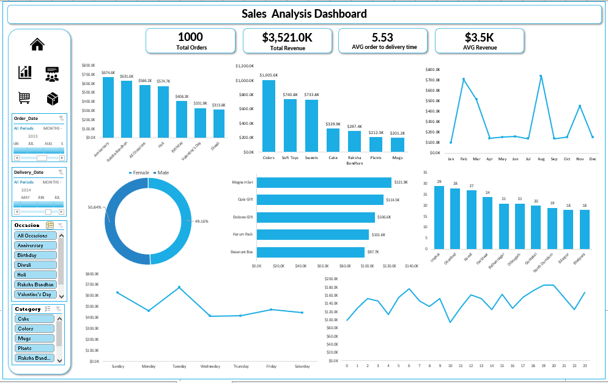

# Excel Dashboard Portfolio

A collection of interactive Microsoft Excel dashboard projects developed using Pivot Tables, Pivot Charts, Slicers, Conditional Formatting, and advanced Excel analytics.

These projects demonstrate business intelligence, data visualization, KPI reporting, and dashboard design using Excel.

---

## Projects Included

- BlinkIT Grocery Dashboard
- Ecommerce Sales Analysis Dashboard
- Road Accident Dashboard
- Sales Dashboard

---

# 1. BlinkIT Grocery Dashboard

### Project Overview

An interactive retail dashboard developed in Microsoft Excel to analyse BlinkIT grocery sales, customer purchasing behaviour, product performance, and outlet insights.

### Features

- Total Sales KPI
- Total Orders
- Average Sales
- Product Category Analysis
- Outlet Performance
- Customer Rating Analysis
- Interactive Slicers
- Dynamic Charts

### Dashboard Preview

<p align="center">

</p>

### Files

- BlinkIT Grocery Data Excel.xlsx
- BlinkIT Grocery Dashboard.PNG

---

# 2. Ecommerce Sales Analysis Dashboard

### Project Overview

An Excel dashboard built for analysing ecommerce sales performance across products, customers, regions, and sales trends.

### Features

- Sales Overview
- Monthly Revenue Trend
- Product Performance
- Customer Analysis
- Regional Sales
- Profit Analysis
- Interactive Filters

### Dashboard Preview

<p align="center">

</p>

### Files

- Ecommerce Sales Analysis.xlsx
- Ecommerce Sales Analysis Dashboard.PNG

---

# 3. Road Accident Dashboard

### Project Overview

A Microsoft Excel dashboard created to analyse road accident data and identify accident patterns using interactive visualisations.

### Features

- Total Accidents
- Fatal vs Non-Fatal Cases
- Casualties Analysis
- Vehicle Type Analysis
- Monthly Trend
- Road Surface Analysis
- Weather Condition Analysis
- Dynamic Filters

### Dashboard Preview

<p align="center">

</p>

### Files

- Road Accident Data.xlsx
- Road Accident Dashboard.PNG

---

# 4. Sales Dashboard

### Project Overview

A business sales dashboard designed in Microsoft Excel to monitor company sales performance, KPIs, customer trends, and product insights.

### Features

- Total Revenue
- Total Profit
- Sales by Category
- Monthly Sales Trend
- Top Performing Products
- Customer Analysis
- Regional Performance
- Interactive Dashboard

### Dashboard Preview

<p align="center">

</p>

### Files

- Sales_Dashbaoard_Using_Excel.xlsx
- Sales_Dashbaoard_Using_Excel.PNG

---

# Tools & Technologies

- Microsoft Excel
- Pivot Tables
- Pivot Charts
- Slicers
- Timeline Filters
- Conditional Formatting
- Lookup Functions
- Data Cleaning
- Data Analysis
- Dashboard Design

---

# Skills Demonstrated

- Data Cleaning
- Data Visualization
- Dashboard Design
- Business Intelligence
- KPI Reporting
- Interactive Reporting
- Excel Analytics
- Pivot Table Analysis
- Business Reporting

---

# How to Use

1. Clone this repository

```bash
git clone https://github.com/srijabiswas-01/excel_dashboard.git
```

2. Open any Excel workbook.

3. Enable Editing.

4. Refresh Pivot Tables if required.

5. Explore the interactive dashboard using slicers.

---

# If you like this project

Please consider giving this repository a ⭐ on GitHub.

It helps support my work and motivates me to create more Data Analytics and Business Intelligence projects.

---

## Author

**Srija Biswas**
---
